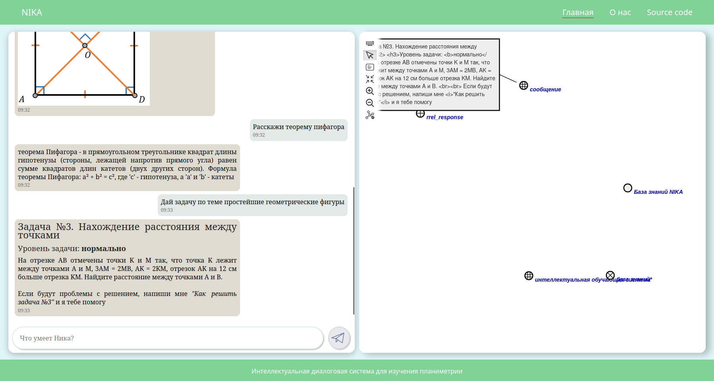

<h1 align="center">Welcome to NIKA 👋</h1>
<p>
  <a href="https://www.gnu.org/licenses/gpl-3.0.html" target="_blank">
    
  </a>
</p>

> **N**IKA is an **I**ntelligent **K**nowledge-driven **A**ssistant

## About
NIKA is an ostis-system designed with [OSTIS Technology principles](https://github.com/ostis-ai) in mind. 
You can learn more about it by asking the assistant: "What's NIKA?"

## Run documentation

```sh
#Terminal
cd nika
pip3 install mkdocs markdown-include mkdocs-material mkdocs-i18n
mkdocs serve
```

Then open http://127.0.0.1:9001/ in your browser

## ✨ Demo



## Requirements
You will need [Docker](https://docs.docker.com/) (with Compose plugin) installed and running on your machine. 

We recommend using Docker Desktop on [macOS](https://docs.docker.com/desktop/install/mac-install/) / [Windows](https://docs.docker.com/desktop/install/windows-install/) and using [Docker Server](https://docs.docker.com/engine/install/#server) distribution for your Linux distribution of choice. Use installation instructions provided in the links above.
## Installation

```sh
git clone -c core.longpaths=true -c core.autocrlf=true https://github.com/kretoffer/nika-planimetry.git
cd nika-planimetry
git submodule update --init --recursive
./install_nika.sh
```

## 🚀 Usage
- Launch
  ```sh
  ./start.sh
  ```

## Authors

* Website: [sem.systems](https://sem.systems/)
* GitHub: [@ostis-apps](https://github.com/ostis-apps), [@ostis-ai](https://github.com/ostis-ai), [@kretoffer](https://github.com/kretoffer)

## Show your support

Give us a ⭐️ if you've liked this project!


## 🤝 Contributing

Contributions, issues and feature requests are welcome!<br />Feel free to check [issues page](https://github.com/kretoffer/nika-planimetry/issues). 

## 📝 License

This project is [GPLv3](https://www.gnu.org/licenses/gpl-3.0.html) licensed.
